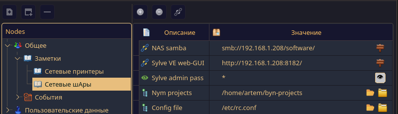
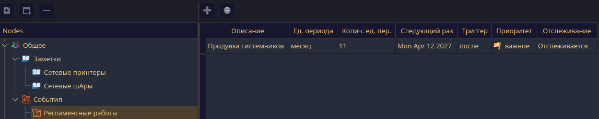

# reminder

GUI (Qt6) application for storing text data and events, both one-time and periodic

Public `events`/`text data` are synchronized in separate streams, in case the admin changes/adds/deletes the shared events.
The structure of the public tree is also monitored in a separate thread.:

if the tree is changed, the displayed resources are cleared (because the linked node is no longer valid) and if editing was underway.. It's not coming anymore.
> Tracking changes to everything that is monitored is queued up, when the time comes, the actual task from the queue is put into the thread pool.

## Text data
format <Description> <Value>: links, file system paths, text data



The type of stored data can be assigned from the context menu. The shared data in a separate thread is synchronized
if the admin remotely fixes/adds/deletes something.

## Events



If the user is logged in, they can change their events both in the table (all except the start date of the periodic event)
and in a separate window (all data is edited). 
To avoid date degradation (the number of days in a month/year varies), the beginning of the period does not change, but can be changed in a separate window.

An event's `trigger` is triggered when an event falls on a weekend - depending on the trigger, such an event is triggered
before the weekend, after the weekend, and strictly according to schedule.
One-time events are deleted after they are triggered.

> A new event appears `Untraceable` to edit it safely.

## Storage

The database library supports storage in MySQL/PostgreSQL, but the program uses only MySQL, which can be fixed in one place without problems (below). 
But 'Postgres` was not tested with the application.  
The program must be compiled with the connection parameters already configured.:

```c++
/** @brief task periods in milliseconds and the type of database server */
struct SProgCfg
{
/** @ brief from the main window in the main thread, poke all resources and a tree with a stick to study the work of your threads */
uint32_t pendingResTimeout_ms{5000};
/** @brief the period for viewing the current set of events to activate them */
uint32_t eventsTrackingPeriod_ms{1000};
/** @brief the period for updating the public tree (both the tree itself and its resources), in case the admin has changed it (the admin does not have this task running) */
uint32_t publicNodesSyncPeriod_ms{10000};
/** @brief The database server type used in the program */
E_DB_TYPE db_type{E_DB_TYPE::EDT_MYSQL};
};

/** @brief database connection parameters */
static SDBConnection sdb_connection
{
.host = "db server IP",
.dbname = "reminder",
.user = "db_user",
.pass = "db_pass",
.ssl_config = SSslConf
{
.is_enabled = false
},
/*.ssl_config = SSslConf{.is_enabled = true, .ca_file = "..."}*/
.is_data_encrypt_enabled = false // don't change
};
```

The connection is configured in the file: `backend/db-models/db_conn.h`
You can also set up an SSL connection. But tested only on MySQL (MariaDB)

Before using the program, you need to run the SQL script on the server from the folder `diary/manuals'. This script creates a base tree.,
the stored procedure `refresh_tracked_nodes` for updating the "children" of publicly available nodes of text and event resources in tables 
`tracked_events_nodes` and `tracked_text_nodes', which are used to compare the data stored on the client and on the server.

The database supports text data encryption. But it should not be included in the program (below).
Encryption-decryption is performed using a library cloned with 
[gitHub](https://github.com/ofiriluz/octo-encryption-cpp)
It was cloned so that possible changes would not break the program.

In `CMakeLists.txt ` this library, like the database library, is included as links to the corresponding repositories.
Recursively cloning is unnecessary. 

***do not enable encryption** - initially, the mechanism for switching from unencrypted
content to encrypted (and vice versa) was not thought out (and has not yet been implemented), despite the transparent work with the database library - for the application, working
with encrypted and unencrypted data is no different.


